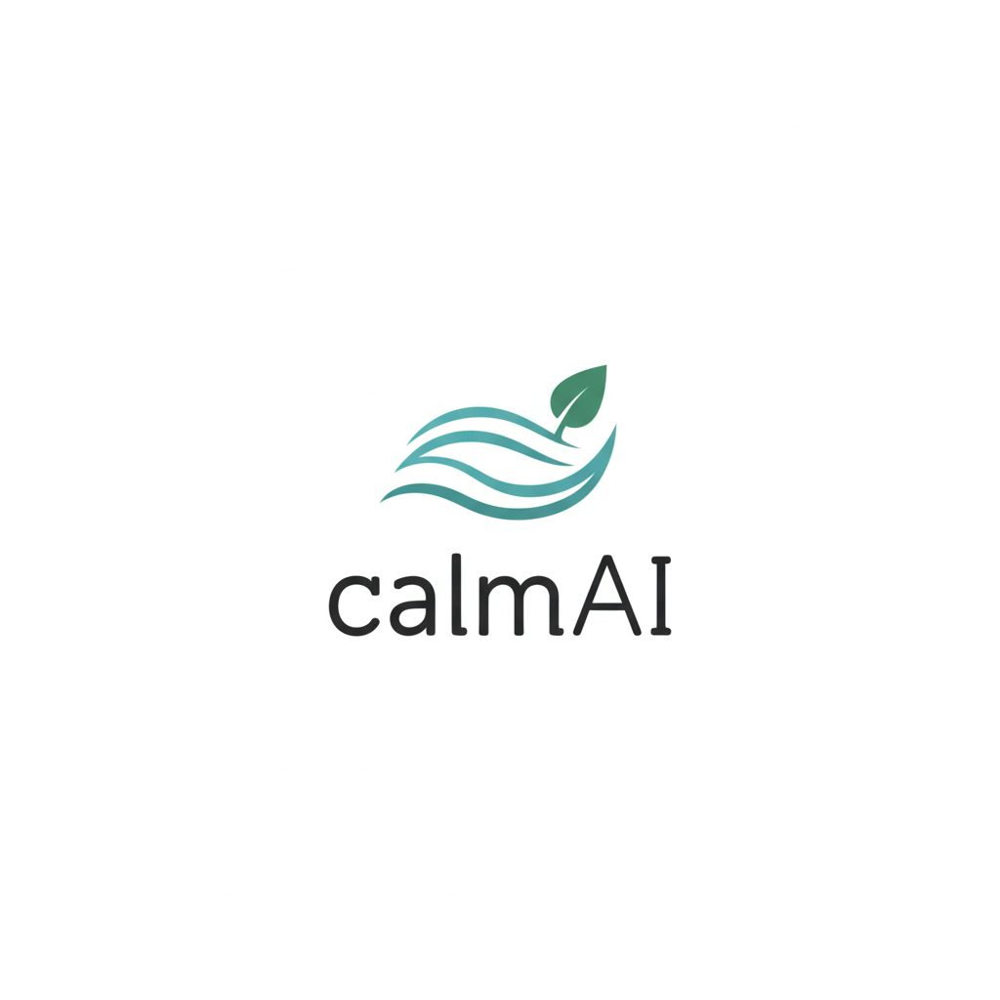

## Takım Adı ✨

### Parlayan Yıldızlar  

## Takım Üyeleri  👥

| İsim                     | Görevi         | Sosyal Ağlar                                                                                                                                   |
|--------------------------|----------------|------------------------------------------------------------------------------------------------------------------------------------------------|
| **Ahmet Fakı**           | Scrum Master   |    |
| **Gökhan Yavuz**         | Developer      |    |
| **Sümeyye Melek Yılmaz** | Developer      |    |
| **Zeynep Hendem**        | Product Owner  |    |

## Ürün Adı 🧠
### calmAI 

## Ürün Logosu

  

## Ürün Açıklaması 📝
calmAI, kullanıcıların günlük hayatlarında karşılaştıkları stresi azaltmalarına yardımcı olacak etkileşimli ve kullanıcı dostu bir web sitesidir. Sitemizde yer alan akıllı chatbotlar sayesinde kullanıcılar kendi stres seviyelerine göre özel sohbetler gerçekleştirebilir, anlık psikolojik destek alabilir ve benzer deneyimleri yaşayan diğer kişilerle güvenli ve samimi bir ortamda iletişim kurabilirler. Aynı zamanda, kullanıcıların stres seviyelerine uygun rahatlatıcı tavsiyeler ve müzik önerileri sunularak stresle başa çıkma süreçleri desteklenir.

  
<h2>Ürün Özellikleri ✨</h2>

- **Kişiselleştirilmiş Chatbot Sohbetleri:** Kullanıcılar, girişte yaptıkları kısa bir stres seviyesi değerlendirmesi sonrasında kendilerine en uygun sohbet botuyla eşleştirilir. Chatbotlar kullanıcının duygu durumuna duyarlı şekilde yapılandırılmış, motive edici, empatik ve yönlendirici yanıtlarla kullanıcıya eşlik eder. Sohbetler, bilgilendirici içerikler ve gevşeme tekniklerine dair önerilerle desteklenir.
  
- **Topluluk Sohbet Alanı:** Platform, kullanıcıların birbirleriyle anonim olarak sohbet edebilecekleri ve deneyimlerini paylaşabilecekleri bir topluluk alanı sunar. Bu bölümde kullanıcılar yalnız olmadıklarını hisseder, duygusal destek bulur ve başkalarının baş etme stratejilerinden ilham alabilir.
  
- **Haftalık Stres Raporlaması:** Kullanıcıların hafta boyunca biriken stres seviyeleri grafiksel ve özet raporlarla sunulur, böylece kullanıcılar stres trendlerini takip edebilir ve ihtiyaç duyduklarında müdahale stratejilerini gözden geçirebilir.
  
- **Günlük Tutma Alanı:** Kullanıcılar duygularını, düşüncelerini ve deneyimlerini anonim bir günlük sayfasında yazabilir; bu sayede kendileriyle ve süreçleriyle ilgili farkındalık kazanır ve ilerlemelerini gözlemleyebilir.
  
- **Özelleştirilmiş Tavsiyeler:** Kullanıcının stres seviyesi ve kişisel ilgi alanlarına göre sistem tarafından dinamik olarak sunulan içerikler, hem zihinsel hem de duygusal rahatlamayı destekleyecek şekilde çeşitlendirilmiştir. Bu kapsamda, anlık rahatlama sağlamaya yönelik yönlendirmeli nefes alma uygulamaları ve basit gevşeme yöntemleri içeren nefes egzersizleri sunulmaktadır. Kullanıcının içinde bulunduğu ruh hâline uygun olarak seçilen motive edici veya sakinleştirici içerikler arasında rahatlatıcı kısa yazılar ve alıntılar yer alır. Duygu durumunu dengelemeye yardımcı olacak şekilde hazırlanmış müzik listeleri ise lofi, doğa sesleri, klasik müzik, ambient ve soft pop gibi çeşitli kategorilerden oluşmaktadır. Ayrıca, kullanıcıların günlük yaşamlarında stres düzeylerini düzenli olarak azaltmalarını hedefleyen küçük ama etkili alışkanlık önerileri de platformda yer almaktadır. Bu öneriler arasında gün sonunda yürüyüş yapmak, dijital molalar vermek veya günlük tutmak gibi basit ama faydalı uygulamalar bulunmaktadır.

- **Gizlilik ve Güvenlik:** Kullanıcıların kişisel bilgileri toplanmaz. Sohbetler anonim olarak gerçekleştirilir ve tüm veri akışı kullanıcı gizliliğini koruyacak şekilde şifrelenir. Platform, güvenli bir deneyim sunmak üzere tasarlanmıştır.
  
- **Açık Kaynak Geliştirme:** calmAI, açık kaynaklı bir projedir. Yazılım geliştiriciler, tasarımcılar ve psikolojiye ilgi duyan katkıcılar, projeye GitHub üzerinden katkıda bulunabilir. Platformun sürdürülebilirliği ve gelişimi, topluluk desteğiyle ilerlemektedir.
  

<h2>Hedef Kitle 🎯 </h2>

 - Yoğun iş temposuna sahip çalışanlar

 - Sınav stresi yaşayan öğrenciler

 - Günlük yaşamın baskılarıyla mücadele eden gençler ve yetişkinler

 - Dijital yollarla duygusal rahatlama arayan herkes

 - Teknolojiye aşina kullanıcılar

 - Dijital deneyimi sınırlı olan bireyler

<h2>Pazarlama Alanı 📈 </h2>

calmAI, modern yaşamın getirdiği stres, kaygı ve duygusal yoğunluklarla başa çıkmak isteyen bireyler için geliştirilen yapay zekâ destekli bir dijital destektir. Kullanıcıların ruh hâline duyarlı chatbotlarla kişiselleştirilmiş sohbetler gerçekleştirmesini sağlayan platform, aynı zamanda stres seviyelerine uygun müzik önerileri, motive edici içerikler ve anonim topluluk sohbet alanlarıyla duygusal rahatlama sunar. calmAI, sınav kaygısı yaşayan öğrencilerden iş hayatında tükenmişlik hisseden profesyonellere kadar geniş bir kitleye hitap eder. Sade ve kullanıcı dostu arayüzüyle dijital deneyimi sınırlı olan kullanıcılar için bile erişilebilir bir yapı sunan calmAI, “Kendini bugün nasıl hissediyorsun?” sorusuyla başlayan yolculukta kullanıcıya güvenli ve samimi bir alan açar. Sosyal medya, üniversite toplulukları, influencer iş birlikleri ve SEO odaklı blog içerikleriyle tanıtımı yapılması planlanan platform, zihinsel ve duygusal sağlığı dijital dünyada desteklemeyi hedefler.

## Sprint 1 🚀
  
### Sprint Notları
- **Sprint içinde tamamlanması tahmin edilen puan:** 100 puan
- **Tahmin mantığı:** Proje boyunca toplamda tamamlanması planlanan 300 puanlık bir backlog oluşturulmuştur. Bu iş yükü üç sprint’e bölünerek dengeli ilerlenmesi hedeflenmiş, Sprint 1 için başlangıç puanı 100 olarak belirlenmiştir. İlk sprintte proje temeli atılmış, arayüz iskeleti çıkarılmış ve sistem entegrasyonları için teknik araştırmalar yapılmıştır.
- **Daily Scrum toplantıları:** Google Meet üzerinden gerçekleştirilmiş; gün içi iletişim de WhatsApp grubu üzerinden sağlanmıştır. Notlar ve Miro panosundaki ilerlemeler ilgili klasörlerde arşivlenmiştir.
- **Sprint Tahtası Ekran Görüntüsü**:
  

  

<h2>Ürünün Ekran Görüntüleri</h2>

  

  

### Teknoloji Yığını

- Python: Proje geliştirme dili olarak belirlendi ve backend yapısı için temel programlama dili olarak kullanılacak.  
- FastAPI: Backend geliştirme sürecinde kullanılmak üzere seçildi.  
- Jinja2 + HTML: Temel arayüz tasarımları için kullanılacak.  
- SQLite: Basit ve yerel veritabanı çözümü olarak projeye entegre edilecek.  
- Gemini API: Yapay zekâ destekli chatbot sistemi için kullanılacak.  
- Git & GitHub: Sürüm kontrolü ve iş birliği için kullanılıyor.  
- Miro: Görev dağılımı ve sprint planlaması için proje yönetim aracı olarak kullanılıyor.  
- Vercel / Docker: Deployment süreci için planlandı.  

##  Kullanıcı Senaryosu
> “Kendini bugün nasıl hissediyorsun?” sorusuyla kullanıcıya yaklaşan sistem, ruh hâlini analiz ederek yapay zekâ destekli empatik yanıtlar sunar. Geçmiş sohbetler veritabanında tutulur ve sistem, kullanıcıyla kurduğu geçmiş diyaloğu hatırlayabilir.

- **Sprint Review**: 

 ○ Ekip ilk kez bir araya gelerek tanışma süreci gerçekleştirdi. Her üye kendi yetkinliklerini ve ilgi alanlarını paylaşarak ekip içi uyum sağlandı.  
 ○ CalmAI proje fikri beyin fırtınası sürecinde önerildi ve tüm ekip üyeleri tarafından olumlu bulunarak seçildi.  
 ○ Takım rolleri belirlendi  
 ○ Proje iletişim düzeni ve görev takibi için kullanılan araçlar kararlaştırıldı (WhatsApp, GitHub, Miro).  
 ○ Kullanıcı senaryoları ve temel işlevler belirlendi.  
 ○ Teknoloji yığını netleştirildi.  

- **Sprint Retrospective**:

 ○ Ekip içerisinde görev dağılımı yapıldı.  
 ○ Kodlama öncesi ihtiyaç analizleri tamamlandı.  
 ○ Görev takibi ve sprint yönetimi için Miro üzerinden dijital scrum panosu oluşturulmasına karar verildi.  
 ○ Sade, erişilebilir ve yapay zekâ destekli bir sistem hedefi benimsendi.  
 ○ Haftalık değerlendirme toplantıları yapılmasına karar verildi.  

