## Takım Adı ✨

### Parlayan Yıldızlar  

## Takım Üyeleri  👥

| İsim                     | Görevi         | Sosyal Ağlar                                                                                                                                   |
|--------------------------|----------------|------------------------------------------------------------------------------------------------------------------------------------------------|
| **Ahmet Fakı**           | Scrum Master   |    |
| **Gökhan Yavuz**         | Developer      |    |
| **Sümeyye Melek Yılmaz** | Developer      |    |
| **Zeynep Hendem**        | Product Owner  |    |

## Ürün Adı 🧠
### calmAI 

## Ürün Logosu

  

## Ürün Açıklaması 📝
calmAI, kullanıcıların günlük hayatlarında karşılaştıkları stresi azaltmalarına yardımcı olacak etkileşimli ve kullanıcı dostu bir web sitesidir. Sitemizde yer alan akıllı chatbotlar sayesinde kullanıcılar kendi stres seviyelerine göre özel sohbetler gerçekleştirebilir, anlık psikolojik destek alabilir ve benzer deneyimleri yaşayan diğer kişilerle güvenli ve samimi bir ortamda iletişim kurabilirler. Aynı zamanda, kullanıcıların stres seviyelerine uygun rahatlatıcı tavsiyeler ve müzik önerileri sunularak stresle başa çıkma süreçleri desteklenir.

  
<h2>Ürün Özellikleri ✨</h2>

- **Kişiselleştirilmiş Chatbot Sohbetleri:** Kullanıcılar, girişte yaptıkları kısa bir stres seviyesi değerlendirmesi sonrasında kendilerine en uygun sohbet botuyla eşleştirilir. Chatbotlar kullanıcının duygu durumuna duyarlı şekilde yapılandırılmış, motive edici, empatik ve yönlendirici yanıtlarla kullanıcıya eşlik eder. Sohbetler, bilgilendirici içerikler ve gevşeme tekniklerine dair önerilerle desteklenir.
  
- **Topluluk Sohbet Alanı:** Platform, kullanıcıların birbirleriyle anonim olarak sohbet edebilecekleri ve deneyimlerini paylaşabilecekleri bir topluluk alanı sunar. Bu bölümde kullanıcılar yalnız olmadıklarını hisseder, duygusal destek bulur ve başkalarının baş etme stratejilerinden ilham alabilir.
  
- **Haftalık Stres Raporlaması:** Kullanıcıların hafta boyunca biriken stres seviyeleri grafiksel ve özet raporlarla sunulur, böylece kullanıcılar stres trendlerini takip edebilir ve ihtiyaç duyduklarında müdahale stratejilerini gözden geçirebilir.
  
- **Günlük Tutma Alanı:** Kullanıcılar duygularını, düşüncelerini ve deneyimlerini anonim bir günlük sayfasında yazabilir; bu sayede kendileriyle ve süreçleriyle ilgili farkındalık kazanır ve ilerlemelerini gözlemleyebilir.
  
- **Özelleştirilmiş Tavsiyeler:** Kullanıcının stres seviyesi ve kişisel ilgi alanlarına göre sistem tarafından dinamik olarak sunulan içerikler, hem zihinsel hem de duygusal rahatlamayı destekleyecek şekilde çeşitlendirilmiştir. Bu kapsamda, anlık rahatlama sağlamaya yönelik yönlendirmeli nefes alma uygulamaları ve basit gevşeme yöntemleri içeren nefes egzersizleri sunulmaktadır. Kullanıcının içinde bulunduğu ruh hâline uygun olarak seçilen motive edici veya sakinleştirici içerikler arasında rahatlatıcı kısa yazılar ve alıntılar yer alır. Duygu durumunu dengelemeye yardımcı olacak şekilde hazırlanmış müzik listeleri ise lofi, doğa sesleri, klasik müzik, ambient ve soft pop gibi çeşitli kategorilerden oluşmaktadır. Ayrıca, kullanıcıların günlük yaşamlarında stres düzeylerini düzenli olarak azaltmalarını hedefleyen küçük ama etkili alışkanlık önerileri de platformda yer almaktadır. Bu öneriler arasında gün sonunda yürüyüş yapmak, dijital molalar vermek veya günlük tutmak gibi basit ama faydalı uygulamalar bulunmaktadır.

- **Gizlilik ve Güvenlik:** Kullanıcıların kişisel bilgileri toplanmaz. Sohbetler anonim olarak gerçekleştirilir ve tüm veri akışı kullanıcı gizliliğini koruyacak şekilde şifrelenir. Platform, güvenli bir deneyim sunmak üzere tasarlanmıştır.
  
- **Açık Kaynak Geliştirme:** calmAI, açık kaynaklı bir projedir. Yazılım geliştiriciler, tasarımcılar ve psikolojiye ilgi duyan katkıcılar, projeye GitHub üzerinden katkıda bulunabilir. Platformun sürdürülebilirliği ve gelişimi, topluluk desteğiyle ilerlemektedir.
  

<h2>Hedef Kitle 🯠</h2>

 - Yoğun iş temposuna sahip çalışanlar

 - Sınav stresi yaşayan öğrenciler

 - Günlük yaşamın baskılarıyla mücadele eden gençler ve yetişkinler

 - Dijital yollarla duygusal rahatlama arayan herkes

 - Teknolojiye aşina kullanıcılar

 - Dijital deneyimi sınırlı olan bireyler

<h2>Pazarlama Alanı 📈 </h2>

calmAI, modern yaşamın getirdiği stres, kaygı ve duygusal yoğunluklarla başa çıkmak isteyen bireyler için geliştirilen yapay zekâ destekli bir dijital destektir. Kullanıcıların ruh hâline duyarlı chatbotlarla kişiselleştirilmiş sohbetler gerçekleştirmesini sağlayan platform, aynı zamanda stres seviyelerine uygun müzik önerileri, motive edici içerikler ve anonim topluluk sohbet alanlarıyla duygusal rahatlama sunar. calmAI, sınav kaygısı yaşayan öğrencilerden iş hayatında tükenmişlik hisseden profesyonellere kadar geniş bir kitleye hitap eder. Sade ve kullanıcı dostu arayüzüyle dijital deneyimi sınırlı olan kullanıcılar için bile erişilebilir bir yapı sunan calmAI, “Kendini bugün nasıl hissediyorsun?” sorusuyla başlayan yolculukta kullanıcıya güvenli ve samimi bir alan açar. Sosyal medya, üniversite toplulukları, influencer iş birlikleri ve SEO odaklı blog içerikleriyle tanıtımı yapılması planlanan platform, zihinsel ve duygusal sağlığı dijital dünyada desteklemeyi hedefler.

## Sprint 1 🚀
  
### Sprint Notları
Sprint 1 boyunca ekip olarak güçlü bir iş birliği içinde çalıştık. Proje planına uygun şekilde teknik araştırmalar tamamlandı ve temel yapılar başarıyla oluşturuldu. Her ekip üyesi, kendisine atanmış görevleri zamanında teslim etmeye özen gösterdi. Sprint 1, hem ekip içi koordinasyonumuzu test etmek hem de projenin zeminini sağlamlaştırmak açısından verimli geçti.
  - Sprint başında takım tanışması ve beyin fırtınası ile proje hedefleri netleştirildi.
  - CalmAI projesi onaylandı ve ekip rollerine göre sorumluluklar atandı.
  - GitHub üzerinde repository oluşturularak temel branch stratejisi belirlendi.
  - Teknoloji yığını (FastAPI, Jinja2, SQLite, OpenAI API) belirlendi, başlangıç konfigürasyonları yapıldı.
  - Kullanıcı senaryoları taslağı oluşturularak temel akış şemalandı.
  - Web sitesinin arayüz iskeleti hazırlandı.
  - Toplantı notları ve ekran görüntüleri arşivlenerek sprint 1 notları kaydedildi.
    
**Sprint içinde tamamlanması tahmin edilen puan:** 100 puan

**Tahmin Mantığı:** Toplamda 300 puanlık backlog, üç sprint’e bölünerek sprint başına 100 puanlık hedef belirlendi. İlk sprintte altyapı ve ön gereksinimler tamamlanarak puan hedefi karşılandı.

**Daily Scrum Toplantıları:**
 - Toplantılar Google Meet üzerinden gerçekleştirildi; gün içi iletişim WhatsApp grubu aracılığıyla sağlandı.
 - Bazı günler bildirim gecikmeleri gözlendi ve Google Takvim hatırlatma sistemi değerlendirilmeye başlandı.
 - Notlar ve Miro panosundaki ilerlemeler ilgili klasörlerde arşivlendi.

- **Sprint Board Ekran Görüntüsü**:
  

  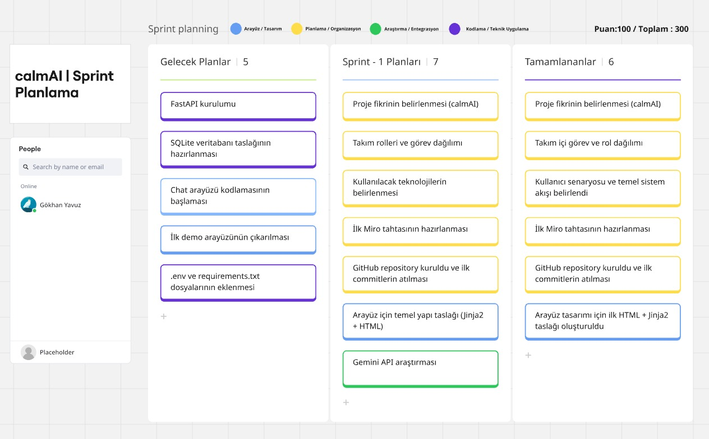

<h2>Daily Scrum Ekran Görüntüleri</h2>

  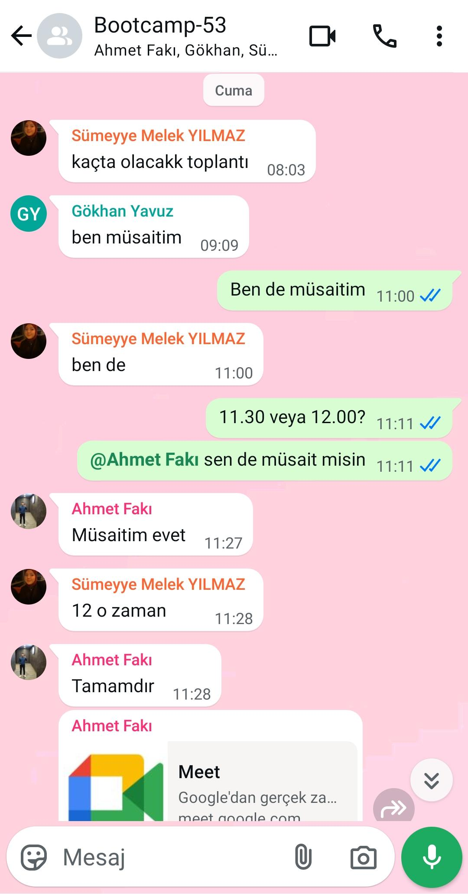

  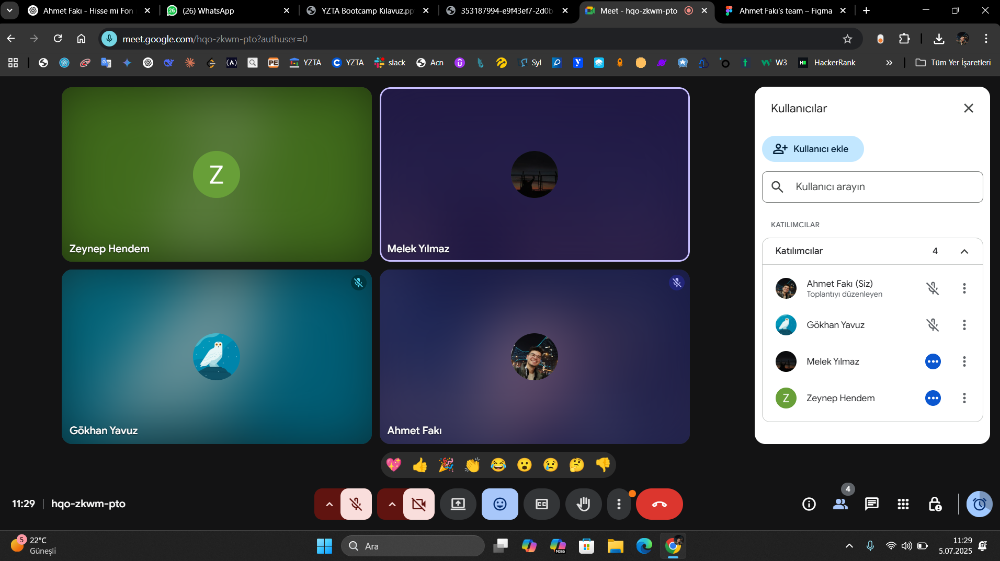

### Teknoloji Yığını
Proje boyunca kullanmayı planladığımız teknolojiler:
- Python: Proje geliştirme dili olarak belirlendi ve backend yapısı için temel programlama dili olarak kullanılacak.  
- FastAPI: Backend geliştirme sürecinde kullanılmak üzere seçildi.  
- Jinja2 + HTML: Temel arayüz tasarımları için kullanılacak.  
- SQLite: Basit ve yerel veritabanı çözümü olarak projeye entegre edilecek.  
- Gemini API: Yapay zekâ destekli chatbot sistemi için kullanılacak.  
- Git & GitHub: Sürüm kontrolü ve iş birliği için kullanılıyor.  
- Miro: Görev dağılımı ve sprint planlaması için proje yönetim aracı olarak kullanılıyor.  
- Vercel / Docker: Deployment süreci için planlandı.

##  Kullanıcı Senaryosu
> “Kendini bugün nasıl hissediyorsun?” sorusuyla kullanıcıya yaklaşan sistem, ruh hâlini analiz ederek yapay zekâ destekli empatik yanıtlar sunar. Geçmiş sohbetler veritabanında tutulur ve sistem, kullanıcıyla kurduğu geçmiş diyaloğu hatırlayabilir.

<h2>Ürünün Ekran Görüntüleri</h2>

  

  

## Sprint Review: 

Ekip ilk kez bir araya gelerek tanışma süreci gerçekleştirdi. Her üye kendi yetkinliklerini ve ilgi alanlarını paylaşarak ekip içi uyum sağlandı.  
 CalmAI proje fikri beyin fırtınası sürecinde önerildi ve tüm ekip üyeleri tarafından olumlu bulunarak seçildi.  
   ○ Takım rolleri belirlendi  
   ○ Proje iletişim düzeni ve görev takibi için kullanılan araçlar kararlaştırıldı (WhatsApp, GitHub, Miro).  
   ○ Kullanıcı senaryoları ve temel işlevler belirlendi.  
   ○ Teknoloji yığını netleştirildi.  

## Sprint Retrospective:

   ○ Ekip içerisinde görev dağılımı yapıldı.  
   ○ Kodlama öncesi ihtiyaç analizleri tamamlandı.  
   ○ Görev takibi ve sprint yönetimi için Miro üzerinden dijital scrum panosu oluşturulmasına karar verildi.  
   ○ Sade, erişilebilir ve yapay zekâ destekli bir sistem hedefi benimsendi.  
   ○ Haftalık değerlendirme toplantıları yapılmasına karar verildi.  

## Sprint 2 🚀
  
### Sprint Notları
Bu sprintin temel amacı, calmAI uygulamasının ana interaktif özelliklerini hayata geçirmek ve kullanıcıya dinamik bir deneyim sunmaktı. Proje görevlerimiz ve hedeflerimiz, proje yönetim aracımız olan Miro'daki Sprint Planlama panosu üzerinden yönetilmektedir.
 - Arayüzün Dinamikleştirilmesi: Kullanıcı girdilerinin (form inputları) JavaScript ile dinamik olarak işlenmesi ve arayüzün etkileşimli hale getirilmesi.
 - Akıllı Stres Değerlendirme Modülü: Kullanıcının girdilerine göre stres seviyesini analiz eden bir modül geliştirmek amacıyla Gemini API entegrasyonunun gerçekleştirilmesi.
 - Kişiselleştirilmiş Chatbot Deneyimi: Değerlendirilen stres seviyesine göre kullanıcıların farklı chatbot karakterleri ile eşleştirilmesinin sağlanması.
 - Veri Kalıcılığı: Haftalık stres verilerinin ileride analiz edilebilmesi için bir simülasyon verisiyle birlikte SQLite veritabanı veya JSON formatında kaydedilmesi için arka plan altyapısının oluşturulması.
 - Raporlama: Sprint boyunca yapılan geliştirmelerin ve ilerlemenin belgelenmesi.

**Sprint içinde tamamlanması tahmin edilen puan:** 100 puan

**Tahmin Mantığı:** Proje yaşam döngüsü boyunca tamamlanması hedeflenen toplam 300 puanlık bir iş havuzunda Sprint 2 için 100 puanlık bir tahmin yapılmıştır. Bir görev tamamlanamamış olduğu için Sprint 2 için toplam 80 puan tamamlanmıştır. İlk iki sprint için toplam puan 180 olmuştur.

**Daily Scrum Toplantıları:** Ekip, sprint verimliliğini artırmak amacıyla günlük Scrum toplantılarında daha proaktif ve katılımcı bir iletişim stratejisi benimseme kararı almıştır.

- **Sprint Board Ekran Görüntüsü**:
  

  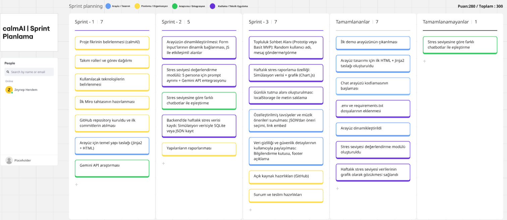

<h2>Daily Scrum Ekran Görüntüleri</h2>

  

  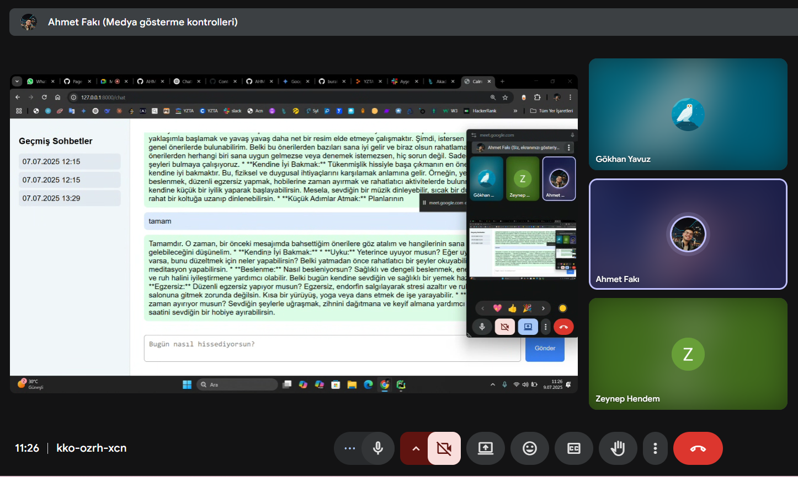

  

  

<h2>Ürünün Ekran Görüntüleri</h2>

  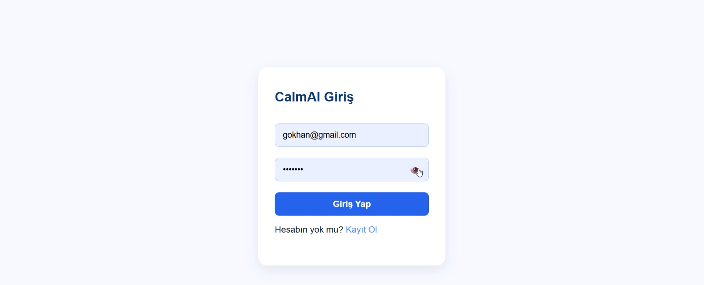

  

  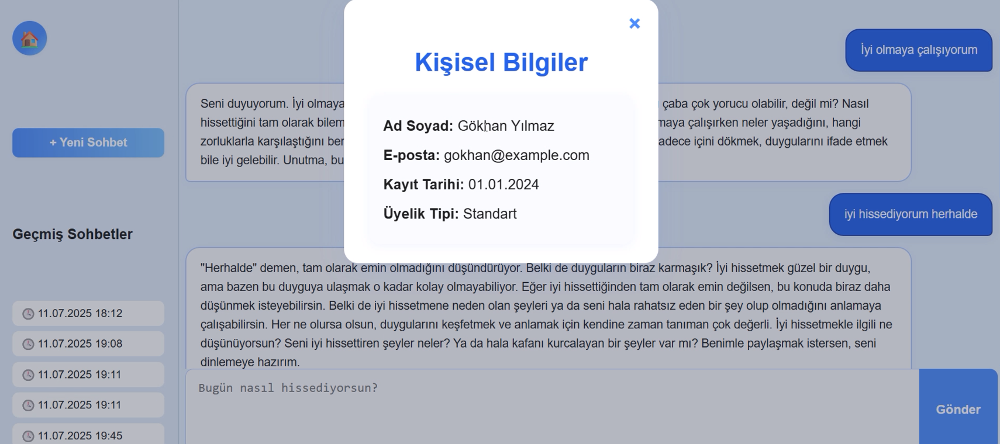

  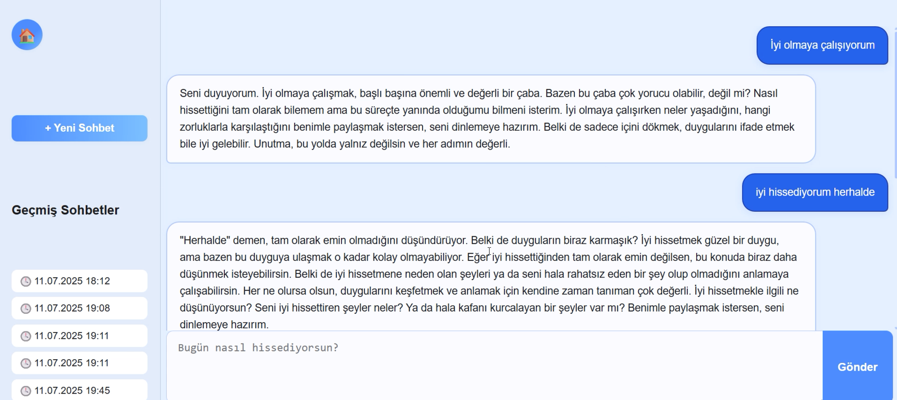

## Sprint Review:

○ Arayüzün dinamikleştirilmesi: Form input'larının dinamik bağlanması ve JS ile etkileşimli alanların geliştirilmesi tamamlandı.

○ Stres seviyesi değerlendirme modülü: 5 persona için prompt ayrımı ve Gemini API entegrasyonu başarıyla gerçekleştirildi.

○ Stres seviyesine göre farklı chatbotlar ile eşleştirme özelliği tamamlandı.

○ Backend'de haftalık stres verisi kaydı: Simülasyon verisiyle SQLite veya JSON kayıt sistemi entegre edildi.

○ Yapılanların raporlanması tamamlandı.

## Sprint Retrospective:

○ Geliştirme süreci boyunca arayüz dinamikleştirme ve chatbot entegrasyonunda karşılaşılan zorluklar değerlendirildi.

○ Backend veri kaydı ve raporlama süreçlerindeki potansiyel iyileştirmeler tartışıldı.

○ Gemini API entegrasyonu sırasında edinilen deneyimler paylaşıldı ve gelecekteki kullanımlar için dersler çıkarıldı.

○ Takım içi iletişim ve iş birliğinin Sprint 2 hedeflerine ulaşmadaki etkinliği gözden geçirildi.

○ Tamamlanan görevlerin kalitesi ve sonraki sprintlere etkisi üzerine geri bildirimler alındı.

## Sprint 3 🚀
  
### Sprint Notları

**Daily Scrum Toplantıları:**
 

- **Sprint Board Ekran Görüntüsü**:
  

  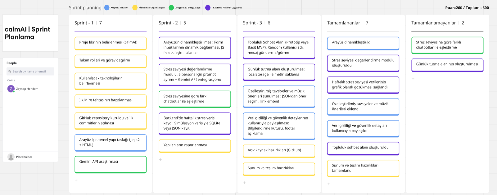

<h2>Daily Scrum Ekran Görüntüleri</h2>

  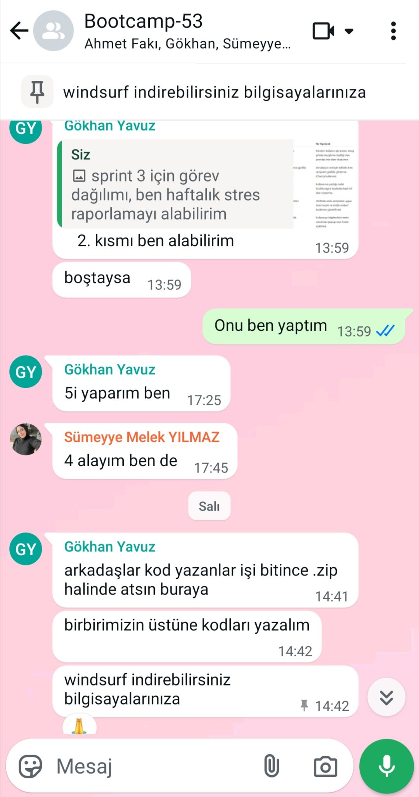

  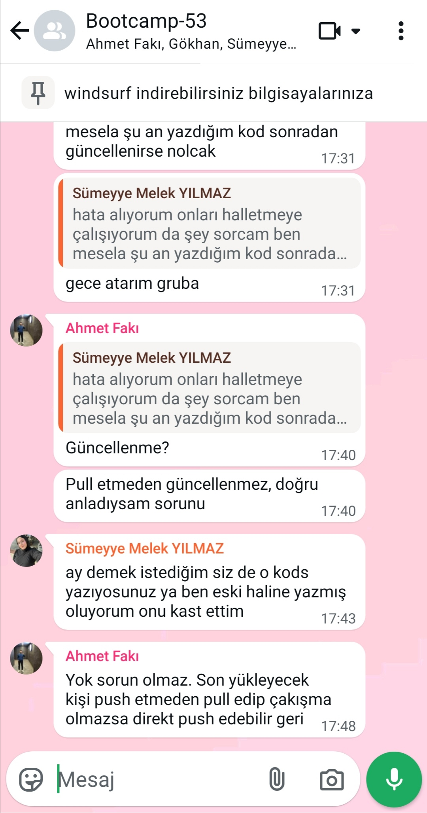

  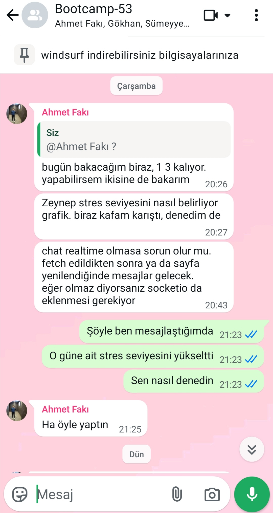

<h2>Ürünün Ekran Görüntüleri</h2>

  

  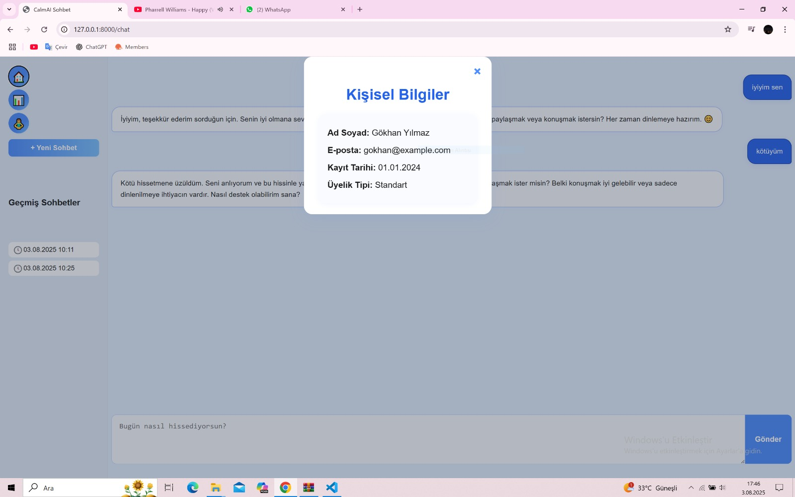

  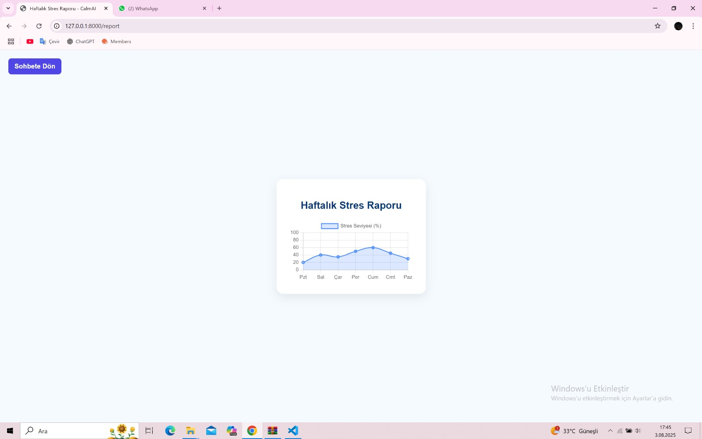

  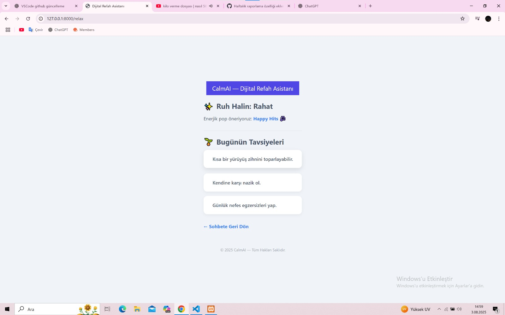

  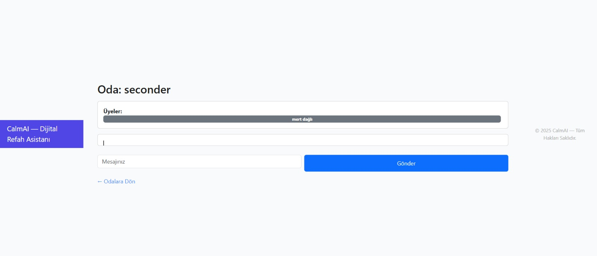

  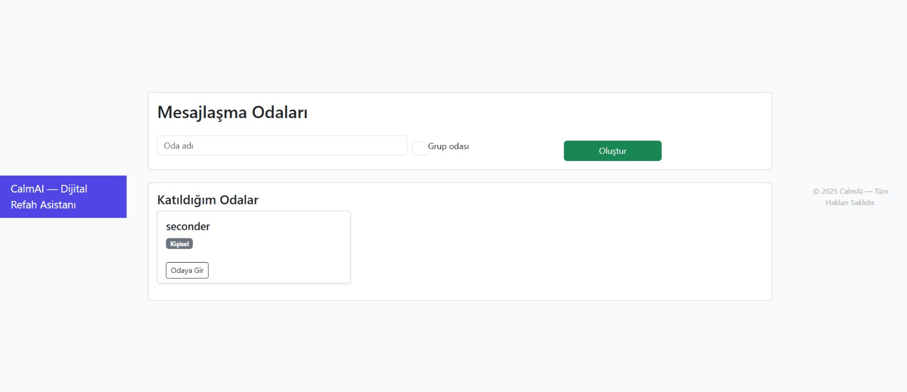

### Sprint Review:

### Sprint Retrospective:

